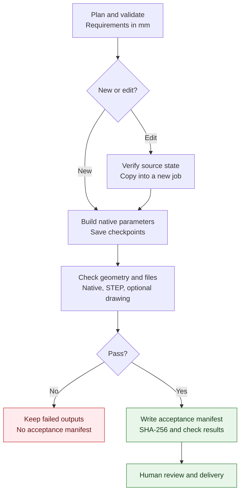
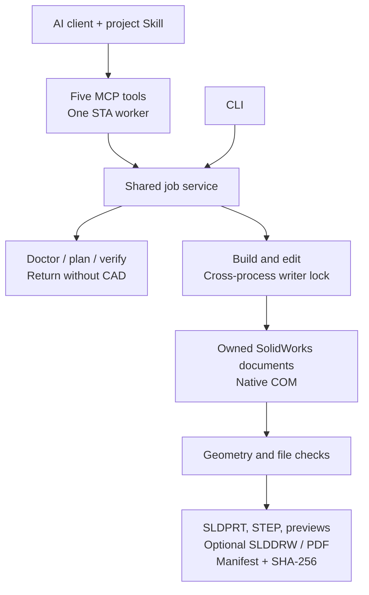

# SolidWorks AI Workflow

**English** | [简体中文](README.zh-CN.md)

AI-assisted · **Noncommercial source-available** · Windows + licensed SOLIDWORKS

A local mechanical modeling workflow with editable native parameters and evidence for every accepted job.

**Define dimensions → validate → build native CAD → check geometry and files → review and deliver.**

The CLI and five MCP tools share one implementation. Input dimensions use millimetres; generated parts contain native SolidWorks dimensions, equations and editable `wf_*` global variables. Each accepted job has its own deliverables and a manifest of the checks actually performed.

**Start here:** [Deploy with one prompt](docs/DEPLOY_PROMPT.md) · [中文部署 Prompt](docs/DEPLOY_PROMPT.zh-CN.md) · [Quick start](#quick-start) · [Standards and evidence](docs/STANDARDS.md)

**v0.3.0 installs and verifies a local workflow; it does not bundle SolidWorks.** The full installer checks real MCP communication. Add `-VerifyCad` to build and validate a synthetic native part before activating project configuration. Host activation and human engineering review remain explicit steps.

## Workflow

The part workflow supports both a new build and a parameter edit. Edits verify the expected source state, create a copy and run acceptance again.



Native part checks must pass before an optional review drawing is generated. Drawing checks then run at the final output location, and the acceptance manifest is written last. Failed outputs remain available for inspection; an automatic pass still requires human engineering review.

## Execution architecture

Both entry points use the same job service. `doctor`, `plan` and `verify` return results without launching SolidWorks; only `build` and `edit` use the native writer.



The default workflow needs no database, vector search, multi-agent scheduler or cloud geometry service. The writer lock coordinates this package's processes; keep SolidWorks idle during a job because it cannot coordinate manual UI actions or unrelated macros.

## Releases and supported scope

| Version | Contents | Status |
| --- | --- | --- |
| [`v0.1.0`](https://github.com/zhenzhis/solidworks-ai-workflow/releases/tag/v0.1.0) | Sanitized original workflow agreements, MCP configuration example and pinned upstream reference | Historical baseline; not the recommended execution entry point |
| [`v0.2.0`](https://github.com/zhenzhis/solidworks-ai-workflow/releases/tag/v0.2.0) | Guarded CLI/MCP execution, parametric templates, evidence manifests, installation and tests | First executable release; still in `0.y.z` initial development |
| [`v0.3.0`](https://github.com/zhenzhis/solidworks-ai-workflow/releases/tag/v0.3.0) | MCP SDK 2.2.0, standard portable Skill, verified installer, protected upgrades and pinned deployment prompts | Recommended release; `0.y.z` initial development |

The original baseline is retained in its Git tag and the [baseline directory](baseline). Private workstation scripts remain in a local, Git-ignored `.local/original-workflow` archive and are not part of the public distribution.

The current executor supports a four-hole **plate**, an L-shaped **bracket**, a **bushing**, and edits to their native global variables. Set `drawing: true` to add a four-view native review drawing and PDF.

Review drawings remain **pilot** quality: dimensions can be duplicated, and layout and manufacturing completeness require human review. Small assemblies, real mates, sheet metal, advanced threads and arbitrary existing-model edits are outside the executor's verified scope. The release does not establish GB/T drawing compliance, complete tolerances or GD&T.

See the [verification record](docs/VALIDATION-v0.3.0.md) for the actual environment, passed cases and limitations. API success and test counts alone do not establish manufacturing quality.

## Quick start

CAD execution requires Windows, a licensed SolidWorks installation, Git and [uv](https://docs.astral.sh/uv/getting-started/installation/). Python 3.11+ is supported; setup selects 3.13 by default and uv can download it. Keep SolidWorks idle during native jobs. Installation discovery, input planning and pure tests can run without CAD, but the Windows deployment script requires a usable CAD installation.

```powershell
git clone --branch v0.3.0 --depth 1 https://github.com/zhenzhis/solidworks-ai-workflow.git solidworks-ai-workflow-v0.3.0
cd solidworks-ai-workflow-v0.3.0
.\scripts\setup.ps1 -VerifyCad

.\.venv\Scripts\sw-workflow.exe doctor
.\.venv\Scripts\sw-workflow.exe plan examples\plate.json
.\.venv\Scripts\sw-workflow.exe build examples\plate.json --job plate-001
.\.venv\Scripts\sw-workflow.exe verify plate-001
```

Setup uses `uv.lock` and a project-local `.venv`. It validates the environment, starts a real stdio MCP subprocess, checks tool schemas and error flags, and optionally runs native CAD acceptance. Only after those checks pass does it write `.codex/config.toml`, the complete `.agents/skills/solidworks-workflow` and a hash receipt. It preserves global Codex configuration. Use `-Python <path-to-python.exe>` to select an interpreter, or `-Development` to include test dependencies.

| Result in `.local/install-report.json` | What has actually passed |
| --- | --- |
| `failed` | A prerequisite, verification or configuration write failed; read `error`. There is no readiness claim. |
| `configured` | CAD installation/import discovery and real MCP protocol checks passed. SolidWorks has not been started or native geometry tested. |
| `cad_smoke_passed` | The checks above plus one bushing built through MCP, native save/reopen, geometry checks, STEP round trip and artifact hashes. |

`-VerifyCad` may start the installed SolidWorks and creates its own synthetic job in `.local/install-checks/<run>/`. Inspect the report and referenced manifest. A success report describes that run; it does not guarantee every CAD version, template or drawing. `doctor` returns a nonzero exit code when discovery fails and never claims native validation.

Open and trust this repository in Codex to use the project Skill and MCP configuration, or use the CLI directly. See the [official MCP documentation](https://developers.openai.com/codex/mcp) for project configuration loading.

Project configuration on disk does not prove the host has loaded it. After opening/trusting the checkout, call `workflow_doctor` and `workflow_plan` in the host. CLI and subprocess checks do not substitute for that host connection.

If template discovery fails, configure valid default templates in SolidWorks or set `SW_WORKFLOW_PART_TEMPLATE` and `SW_WORKFLOW_DRAWING_TEMPLATE` to local files. A part template must contain exactly one configuration. Commercial software, installed templates and SDK binaries are not distributed with this project.

### Copy-and-paste deployment prompt

Give a local coding agent the [complete English prompt](docs/DEPLOY_PROMPT.md) or [中文 Prompt](docs/DEPLOY_PROMPT.zh-CN.md). Both pin **v0.3.0**, select a new versioned directory, preserve existing changes and require the actual native-check report. They include exact stop conditions for missing CAD, permissions or failed validation; they do not request blanket approval or global configuration changes.

### Skill only, for an existing runtime

The portable Skill follows the [Agent Skills format](https://agentskills.io/specification) and includes its usage reference and license. For an already configured runtime, [Vercel's skills CLI](https://github.com/vercel-labs/skills) can discover/install just the instructions:

```powershell
npx --yes skills@1.7.0 add https://github.com/zhenzhis/solidworks-ai-workflow/tree/v0.3.0/skills/solidworks-workflow --agent codex --copy
```

Run this in the intended client project. Node.js/npm is needed only for this optional route. It **does not** install Python dependencies, MCP configuration or SolidWorks. Do not install it again when full setup already installed the project Skill. Other Agent Skills hosts can read the portable instructions; only the Codex project configuration is generated and tested here.

### Upgrade and rollback

Prefer a separate versioned clone for upgrades. Existing environments, jobs and release assets remain available for rollback by reopening the previous checkout. Do not run `git reset --hard`, `git clean` or force-update a released tag.

The installer can also upgrade receipt-managed files when their hashes still match, and migrate the exact generated v0.2.0 Skill. User-modified configuration or Skill resources stop installation with their file path. Resolve that conflict explicitly; no automatic merge or overwrite is performed. Configuration write failures roll back files written by this run. The Python environment itself is not transactional, which is why versioned clones are recommended. Existing artifact manifests keep their recorded runtime version.

## Parameter edits and deliverables

```powershell
$state = (.\.venv\Scripts\sw-workflow.exe verify plate-001 | ConvertFrom-Json).manifest_sha256
.\.venv\Scripts\sw-workflow.exe edit plate-001 --job plate-002 --parameters examples\plate-edit.json --expected-state $state

# Optional four-view review drawing: SLDDRW / PDF / BMP
.\.venv\Scripts\sw-workflow.exe build examples\plate-drawing.json --job plate-drawing-001
```

An edit copies the accepted native file, updates its native global variables, rebuilds it and repeats acceptance. The source job stays unchanged, and an existing job name cannot be reused. Drawing references are created at the final output location to avoid references to a moved staging directory.

Successful jobs are stored in `artifacts/<job>/`:

| Output | Purpose |
| --- | --- |
| `.SLDPRT` | Editable native part with dimensions and global variables |
| `.step` | Interchange geometry checked by re-importing it |
| `.bmp` | Model preview for visual inspection |
| `manifest.json` | Specification fingerprint, software versions, configuration, dimension bindings, checks, timing and artifact SHA-256 values |
| Optional `.SLDDRW`, `.pdf` and drawing preview | Native review drawing and review copies |

Automatic acceptance checks the solid-body count, analytic volume, exact body extents, cylindrical hole positions and diameters, native millimetre units, feature errors, driving dimensions, fully constrained sketches, native save/reopen and STEP round trips.

`verify` checks **artifact integrity only**. It does not start CAD or repeat geometry checks, and a manifest hash is not a digital signature or authenticity guarantee.

The final manifest is the acceptance marker. A failed job may leave a `.partial` directory or a `failure.json` in the final output directory; a directory without an acceptance manifest must not be presented as accepted. If COM blocks, inspect local dialogs and checkpoints before sending another modeling request. Universal timeout cancellation and crash recovery are not guaranteed.

## Five MCP tools

| Tool | Purpose |
| --- | --- |
| `workflow_doctor` | Discover installation and dependencies without starting CAD |
| `workflow_plan` | Validate a specification and calculate independent geometry targets |
| `workflow_build` | Build, export and validate a new owned job |
| `workflow_edit` | Check the expected source state and edit native variables in a copy |
| `workflow_verify` | Check artifact hashes and return the current manifest fingerprint |

Failures propagate through MCP `isError`; successful tools return structured JSON with declared output schemas. The schemas describe object envelopes; strict millimetre and geometric rules are enforced by the shared specification parser. The pinned official SDK **2.2.0** supports the `2026-07-28` protocol and legacy negotiation. Real stdio tests exercise current and `2025-11-25` connections.

The server uses one STA worker, at most eight outstanding calls and a cross-process writer lock. Cancellation does not release a still-running job's capacity. Its output root is fixed by startup configuration. The tool surface exposes neither arbitrary Python execution nor a whole-session close operation. This is a local stdio integration; tool annotations describe behavior and are not an authorization boundary.

`swapi-pilot` is an optional documentation service: add `-WithDocumentation` during setup to generate its project configuration. Send only generic API names or questions, not private models. Jev is not a default dependency; future semantic assistance should be added only when its benefit is measurable. Neither service participates in the current templates' geometry calculations.

## Development and maintenance

```powershell
uv sync --frozen --extra cad --extra mcp --extra test
uv run --no-sync pytest -q
uv build

# Run only on an explicitly selected, idle Windows CAD workstation.
# Use a fresh run-id each time.
uv run --no-sync python scripts\native_regression.py --live --run-id trial01
```

Hosted CI runs pure tests, real stdio MCP protocol tests, package builds and distribution checks without connecting to a CAD workstation. The native regression covers the three templates' creation and edits, unchanged source jobs, preservation of an unrelated unsaved document, a review drawing and one real MCP CAD build. It does not replace cross-version regression or human engineering review.

The project follows [SemVer](https://semver.org/). Published tags stay immutable; during `0.y.z`, incompatible contract changes increment the minor version and compatible fixes increment the patch version. See [DESIGN](docs/DESIGN.md) for architecture and future priorities, and [CHANGELOG](CHANGELOG.md) for release differences.

The [standards record](docs/STANDARDS.md) separates normative Agent Skills/MCP requirements from ideas adopted from `mattpocock/skills` and Vercel's installer. Format validation, actual transport checks, native acceptance and release-content checks are separate evidence layers. We make no universal “best workflow” or full protocol-certification claim.

## Provenance and license

Original execution controls, contracts, acceptance checks and tests use **[PolyForm Noncommercial 1.0.0](LICENSE)**. Use must comply with its noncommercial terms. This is **source-available software, not OSI-defined open source**.

Selected MIT modules from `wzyn20051216/solidworks-automation-skill` retain their original source and independent MIT license. The repository, commit and per-file hashes are recorded in [upstream.lock.json](upstream.lock.json); those modules are not claimed as original project code, and their MIT rights are not revoked. See [THIRD_PARTY_NOTICES](THIRD_PARTY_NOTICES.md) for attribution and other references.

Private CAD, student originals, reference photos, credentials, commercial software, templates and SDK binaries are excluded from public distributions. Use independently created synthetic examples when contributing.

## 中文说明

本项目以英文文档为主，提供[完整简体中文说明](README.zh-CN.md)。核心流程为“明确参数 → 预检 → 原生建模 → 几何与文件验收 → 人工工程复核”；原创部分采用非商业源码公开许可。
